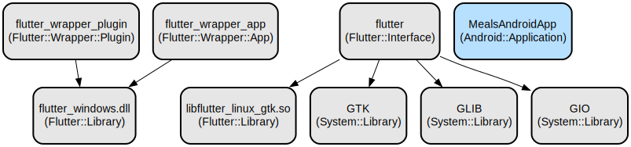

# Flutter Multi-App Development Environment: A Collection of Cross-Platform Applications

This repository contains a collection of Flutter applications designed to demonstrate various aspects of cross-platform development. The project includes multiple applications ranging from expense tracking to quiz games, showcasing different Flutter widgets, state management techniques, and platform-specific implementations.

The repository is structured as a comprehensive learning and development environment, featuring multiple Flutter applications that demonstrate different aspects of mobile and desktop development. Each application is built using Flutter's cross-platform framework, supporting Android, iOS, Linux, macOS, and Windows platforms. The applications showcase various UI patterns, state management approaches, and platform-specific integrations through a collection of independent projects.

## Repository Structure
```
.
├── bug_app/                    # Bug tracking application with quiz functionality
│   ├── lib/                    # Core application logic and UI components
│   │   ├── data/              # Data models and static content
│   │   ├── models/            # Business logic models
│   │   └── widgets/           # Reusable UI components
│   └── platform/              # Platform-specific implementations (Android, iOS, Linux, Windows)
├── expense_tracker/           # Expense tracking application
│   ├── lib/                   # Application source code
│   │   ├── models/           # Data models for expenses
│   │   └── widgets/          # UI components including charts and lists
├── first_app/                # Basic Flutter application template
│   └── lib/                  # Core application code
├── flutter_internals/        # Flutter internal concepts demonstration
│   └── lib/                  # Source code showcasing Flutter internals
├── meals/                    # Food and meals application
│   ├── lib/                  # Application source code
│   │   ├── screens/         # Screen definitions
│   │   ├── models/          # Data models
│   │   └── widgets/         # Reusable UI components
└── quizz_app/               # Interactive quiz application
    ├── lib/                 # Application source code
    │   ├── data/           # Quiz questions and answers
    │   └── models/         # Quiz-related data models
```

## Usage Instructions
### Prerequisites
- Flutter SDK (latest stable version)
- Dart SDK (latest stable version)
- Android Studio or VS Code with Flutter extensions
- For platform-specific development:
  - Android: Android SDK and Android Studio
  - iOS: Xcode and CocoaPods (macOS only)
  - Windows: Visual Studio with C++ desktop development workload
  - Linux: GTK development libraries
  - macOS: Xcode command-line tools

### Installation
1. Clone the repository:
```bash
git clone <repository-url>
cd flutter-multi-app
```

2. Install dependencies for each application:
```bash
cd <app-directory>
flutter pub get
```

3. Platform-specific setup:

**Windows:**
```bash
# Install Visual Studio with C++ desktop development workload
# Install CMake if not included with Visual Studio
flutter config --enable-windows-desktop
```

**Linux:**
```bash
# Install required dependencies
sudo apt-get install clang cmake ninja-build pkg-config libgtk-3-dev
flutter config --enable-linux-desktop
```

**macOS:**
```bash
flutter config --enable-macos-desktop
xcode-select --install
```

### Quick Start
1. Choose an application to run:
```bash
cd <app-directory>
flutter run
```

2. Select a target platform when prompted, or specify directly:
```bash
flutter run -d windows  # For Windows
flutter run -d linux    # For Linux
flutter run -d macos    # For macOS
flutter run -d ios      # For iOS
flutter run -d android  # For Android
```

### More Detailed Examples
Each application has its own specific usage:

**Expense Tracker:**
```dart
// Add a new expense
final expense = Expense(
  title: 'Groceries',
  amount: 50.00,
  date: DateTime.now(),
  category: Category.food,
);
```

**Quiz App:**
```dart
// Start a new quiz
Navigator.of(context).pushReplacement(
  MaterialPageRoute(builder: (ctx) => const QuestionsScreen()),
);
```

### Troubleshooting
Common issues and solutions:

1. Build Failures
```bash
# Clean and rebuild
flutter clean
flutter pub get
flutter run
```

2. Platform-specific Issues
- Windows: Ensure Visual Studio and Windows 10 SDK are installed
- Linux: Verify GTK development libraries are present
- macOS: Ensure Xcode command-line tools are installed

3. Performance Issues
- Enable performance overlay:
```dart
MaterialApp(
  showPerformanceOverlay: true,
  // ...
)
```

## Data Flow
The applications follow a unidirectional data flow pattern where state management is handled through Flutter's built-in state management solutions.

```
[User Input] -> [Widget State] -> [Business Logic] -> [UI Update]
     ^                                                    |
     |                                                    |
     +----------------------------------------------------+
```

Key interactions:
- User input is captured by widget event handlers
- State changes trigger UI updates through setState or state management solutions
- Data persistence is handled through platform-specific storage
- Cross-platform compatibility is maintained through Flutter's abstraction layer
- Platform channels handle native functionality when required

## Infrastructure


The project uses CMake for native builds on desktop platforms:

**Windows Resources:**
- flutter_windows.dll: Core Flutter runtime
- Generated plugin registrant: Plugin registration
- Runner: Main application executable

**Linux Resources:**
- libflutter_linux_gtk.so: Flutter GTK integration
- GTK3 dependencies: UI rendering
- Platform channels: Native functionality

**Build Configuration:**
- CMake minimum version: 3.14
- C++ Standard: C++17
- Compiler settings: Various platform-specific optimizations